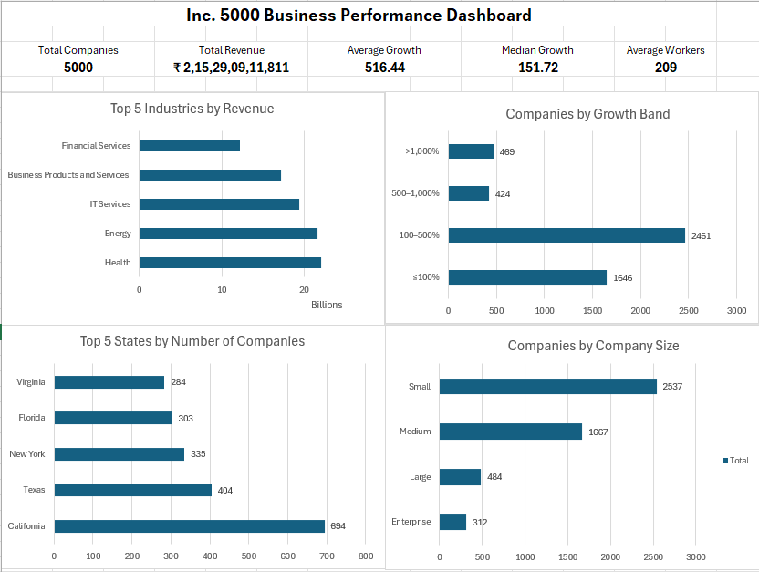
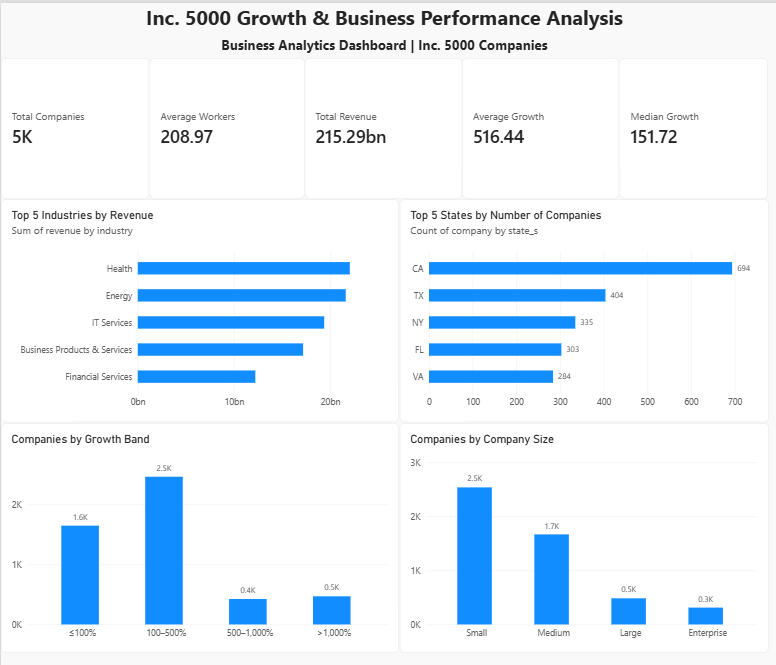

# Inc. 5000 Growth & Business Performance Analysis

A business analytics project built around the Inc. 5000 company dataset. The goal was to understand what separates high-growth companies from larger, more established businesses by looking at revenue, growth, workforce size, industry, company size, and geography.

I worked through the analysis in Excel first, used MySQL to take the analysis further, and then built a Power BI dashboard to present the main findings.

---

## Project Overview

The dataset contains 5,000 Inc. 5000 companies. Rather than focusing only on which companies grew the most, I wanted to look at the numbers from a business perspective:

- Which industries generate the most revenue?
- Which industries are growing the fastest?
- Does company size have a clear relationship with growth?
- Where are high-growth companies concentrated?
- Is average growth actually representative of most companies?
- Does higher revenue automatically mean higher growth?
- Which companies stand out within their own industries?

The analysis combines descriptive analysis, segmentation, comparisons, and SQL-based ranking to answer these questions.

---

## Business Problem

A high growth percentage does not necessarily mean a company is large, and a large company does not necessarily have the highest growth.

The project therefore looks at **growth and scale together**, instead of using a single metric to judge business performance.

The analysis was structured around four areas:

1. Growth performance
2. Revenue and company scale
3. Industry and company-size differences
4. Geographic concentration

---

## Tools Used

| Tool | Purpose |
|---|---|
| Excel | Data cleaning, exploration, PivotTables, analysis and initial dashboard |
| MySQL | Business analysis, segmentation, ranking and advanced queries |
| Power BI | Interactive business dashboard and visual storytelling |
| GitHub | Project documentation and portfolio presentation |

### SQL techniques used

The SQL analysis includes:

- Aggregations with `GROUP BY`
- Conditional segmentation using `CASE`
- Filtering with `HAVING`
- Common Table Expressions (CTEs)
- Window functions
- `RANK()` for industry-level benchmarking
- Revenue and growth segmentation
- Industry × company-size analysis
- Multi-metric opportunity scoring

---

## Analysis Approach

The project was completed in three stages.

### 1. Excel Analysis

I first cleaned and reviewed the dataset before building the initial analysis.

The Excel work covered:

- Industry analysis
- Company-size analysis
- Geographic analysis
- Growth distribution
- Revenue and workforce relationships
- Key findings and business implications
- Initial dashboard

### 2. SQL Analysis

The cleaned dataset was imported into MySQL and used for more detailed analysis.

Some of the questions explored in SQL were:

- Which industries combine revenue scale and growth?
- How does performance vary by company size?
- Which states have a meaningful combination of scale and growth?
- How concentrated is company growth?
- Which companies combine high revenue with high growth?
- Who are the top revenue companies within each industry?
- Who are the top growth companies within each industry?
- Which industry-size combinations perform best?
- How does growth change across revenue segments?
- Which industries show the strongest overall opportunity?

### 3. Power BI

The final Power BI dashboard brings the main results together into a single view.

---

## Dashboard

### Excel Dashboard



### Power BI Dashboard



---

## Key Findings

### 1. Revenue leaders and growth leaders are not necessarily the same

Health generated the highest total revenue at approximately **$22.02B**, while Energy generated approximately **$21.60B**.

However, Energy had much higher average growth:

- Health: **637.63% average growth**
- Energy: **970.04% average growth**

This shows why revenue scale and growth rate need to be considered separately.

---

### 2. The average growth rate is heavily influenced by extreme performers

The overall average growth was **516.44%**, while the median was only **151.72%**.

The distribution makes the difference clearer:

| Growth range | Companies | Share |
|---|---:|---:|
| ≤100% | 1,646 | 32.92% |
| 100–500% | 2,461 | 49.22% |
| 500–1,000% | 424 | 8.48% |
| >1,000% | 469 | 9.38% |

So **82.14% of companies had growth of 500% or less**, while a much smaller group accounted for growth above 500%.

For this dataset, the median provides a much better sense of what a typical company looks like than the average alone.

---

### 3. Company size does not have a simple relationship with growth

Enterprise companies generated the most total revenue:

**$87.32B**

But Large companies recorded the highest average growth:

**706.90%**

There was also a large difference between average and median growth for Large companies, suggesting that extreme observations have a strong effect on the average.

This is why I used both average and median when comparing company-size groups.

---

### 4. California combines scale with strong growth

California had the largest number of companies in the dataset:

**694 companies**

It also recorded the highest average growth among states with at least 50 companies:

**876.20%**

Other states also showed strong growth, including Arizona at **778.16%**.

The minimum-company threshold was used for geographic growth comparisons to avoid drawing conclusions from states represented by only a small number of companies.

---

### 5. More revenue does not automatically mean more growth

The revenue-segment analysis produced an interesting pattern.

Average growth increased through the **$100M–$500M** revenue segment, where it reached approximately **952.97%**.

However, companies above **$500M** had much lower average growth of approximately **165.40%**.

This suggests that revenue scale alone is not a reliable indicator of future growth potential.

---

### 6. Revenue and workforce have only a weak positive relationship

The correlation analysis showed:

| Relationship | Correlation |
|---|---:|
| Revenue vs Workers | 0.266 |
| Revenue vs Years on List | 0.151 |
| Revenue vs Growth | 0.002 |

Revenue has some positive association with workforce size, but the relationship is still weak.

More importantly, the correlation between revenue and growth is essentially zero in this dataset. This reinforces the idea that **being larger does not automatically mean growing faster**.

---

### 7. Growth differs significantly across industry-size combinations

Looking at industry and company size together revealed patterns that would be missed by analysing either variable independently.

For example:

**Energy × Small companies**

- 52 companies
- **1,478.25% average growth**

Other strong combinations included Government Services × Small and Health × Medium.

This suggests that company size should be evaluated in the context of the industry in which the company operates.

---

## SQL Analysis

The SQL file contains the complete analysis performed in MySQL.

The advanced analysis includes:

1. Industry Performance Scorecard
2. Company Size Performance
3. Geographic Opportunity
4. Growth Segmentation
5. High Revenue + High Growth Companies
6. Revenue Ranking Within Industry
7. Growth Leaders Within Industry
8. Industry × Company Size Analysis
9. Revenue Segment vs Growth
10. Industry Opportunity Scorecard

The ranking analyses use SQL window functions to compare companies against their industry peers rather than simply ranking all companies together.

---

## Business Implications

A few broader takeaways from the analysis:

- **Growth and scale should be evaluated separately.** High revenue does not guarantee high growth.
- **Median and distribution matter when growth is highly skewed.** A small group of extreme performers can significantly increase the average.
- **Industry context matters.** The same company size can have very different growth characteristics across industries.
- **Geographic analysis should consider sample size.** A state with very few companies can produce an unreliable average.
- **Industry benchmarking is more useful than one overall ranking.** Comparing companies against similar businesses gives a more meaningful view of performance.
- **High growth at significant scale is uncommon.** Only one company in the dataset met both the $1B revenue and 500% growth thresholds used in the analysis.

---

## Project Structure

```text
inc5000-business-analysis/
│
├── README.md
│
├── excel/
│   └── Inc5000_Analysis.xlsx
│
├── powerbi/
│   └── Inc5000_Dashboard.pbix
│
├── screenshots/
│   ├── excel-dashboard.png
│   └── powerbi-dashboard.png
│
└── sql/
    └── Inc5000_SQL_Analysis.sql
```

---

## What I Learned

The main takeaway from this project was that business analysis is not just about producing charts or calculating averages.

The more useful part was deciding **which questions to ask**, checking whether a result was actually representative, and then looking at the same business problem from different angles.

For example, the difference between average growth (**516.44%**) and median growth (**151.72%**) initially looks surprising. Breaking the companies into growth bands helped explain why.

Similarly, comparing revenue and growth separately showed that the largest companies were not necessarily the fastest-growing companies.

That process of moving from **data → question → analysis → finding → business implication** was the main focus of this project.
